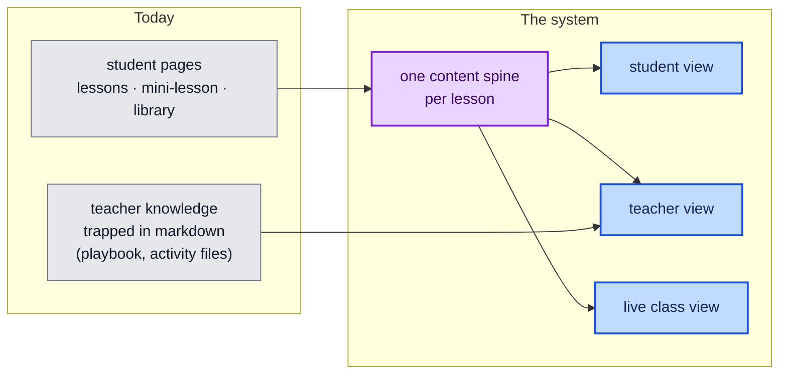
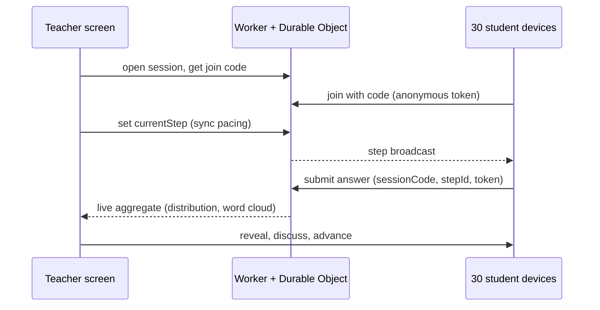

# The Learning System

Design doc for turning lessons.mattvalancy.com from a collection of good pages into a
reusable learning system. Synthesized from three verified research sweeps (2026-08-22):
teacher-material anatomy (Illustrative Mathematics, OpenSciEd), platform interaction
taxonomy (Oppia, H5P, Nearpod, Kahoot, Mentimeter, Brilliant, Khan), and a
license-verified library audit. Every claim here traces to a fetched source or to this
repo's own constraints.

**The goal in one sentence:** one content spine, three views (student, teacher, live
class), built from a small closed set of reusable components, with our own identity
(the living graph, per-section animations, our games) as the pizzazz layer.

## What we have vs. what a system needs



A teacher preparing Module 4 today reads a lesson page and then digs through GitHub
markdown. That seam is the whole problem.

## 1. The teacher layer

The verified gold standard is Illustrative Mathematics: **parallel pages at a shared
lesson coordinate**, not an inline toggle. Same lesson id, separate URLs per audience,
cross-linked. The teacher page *embeds* the student content inline in labeled blocks so
the teacher never alt-tabs mid-class.

Our version, within the no-build rule:

- `/intro-ai-tools/lessons/04-spreadsheets-data.html` stays the student page.
- `/intro-ai-tools/lessons/04-spreadsheets-data.teacher.html` is the teacher page:
  teacher material in the main column with the student content pulled in beside it.
- Single source of truth without a build step: the teacher page fetches the student
  page and injects the marked sections (`data-embed="#activity-2"`), progressive
  enhancement style. With JS off it degrades to "open the student view" links.
- Visually, the teacher page reads as the sidebar experience: student content in
  the center, teacher notes wrapping it. One page, both worlds.

**Fixed teacher-page schema, same shape every lesson** (learned from IM, stocked from
our own lab playbook):

1. **Prep** (its own surface, always first): materials list, accounts to pre-stage,
   the 15-minutes-before checklist, wifi fallback, prior-lesson dependencies.
2. Learning goals + the module's job-skills line.
3. Timing bar for the session (the playbook's minute tables).
4. Per activity, repeating: timing · launch script · **embedded student content** ·
   floor and stretch moves · anticipated wrong turns · discussion questions with
   sample answers.
5. Spotlight-sweep prompts and the wander-block menu.
6. Synthesis + exit ticket + homework handoff.

**No gating.** IM gates answer keys and OpenSciEd gates unit downloads because they
are commercial products. We are not. The `/teacher` URL convention plus a one-line
banner is enough to keep spoilers out of students' way.

A named-routines glossary (IM's other trick) already exists here: the teaching
scaffold. The teacher pages reference routines by name (driver/navigator, spotlight
sweep, wander block) and link the scaffold once.

## 2. The component grammar

A closed set of blocks that appear identically in every lesson. Closure is what makes
generic tooling possible (Oppia's core insight: every state has the same contract, so
analytics, hints, and aggregation work everywhere).

**Content blocks** (CSS components, exist partly today):

| Block | Purpose |
|---|---|
| `warmup` | the opening game or prompt, one per session |
| `big-idea` | the one-sentence claim of the segment |
| `activity` | task card with built-in **floor / stretch** tabs |
| `check` | self-check interaction (see contract below) |
| `reflect` | open reflection, reused as mid-lesson pause and exit ticket |
| `materials` | what this lesson needs |
| `teacher-note` | renders only on teacher pages |
| `game` | embedded game/explorable, ours or from the verified shelf |

**Interaction contract** (Oppia's per-state shape, our v1 enum is four types):

```
{ type: multipleChoice | textInput | numericInput | openReflection,
  prompt, choices?, answerRules, feedback, hints[], solution? }
```

Implemented as small vanilla web components (`<ai-check>`, `<ai-reflect>`), no
dependencies, defined once in `js/learn-blocks.js`. Authored inline in the HTML as
JSON in a `<script type="application/json">` child. No build step, no framework.

**Two orthogonal delivery flags, never separate content** (verified across Nearpod,
Kahoot, Quizizz): `pacing: sync | async` and `stakes: practice | graded | anonymous`.
Author once; the same check runs as a solo self-check today and a live class poll
later.

## 3. Differentiation, built in

The answer to "challenge some without scaring the others," assembled from verified
mechanics:

- **Floor/stretch tabs inside every activity card.** Same task, student picks depth,
  nobody is labeled. This is our existing pedagogy made into UI.
- **Hint ladders on checks** (Oppia): hint 1, hint 2, then the worked solution.
  Reaching for hints is designed in, not shameful.
- **Stakes toggle**: every check defaults to practice; anonymity is a per-session
  choice (Mentimeter's lesson: anonymous-by-default lets mixed-confidence rooms
  answer without fear).
- **Self-paced escape valve**: any synced live activity has an async twin because
  pacing is a flag, not different content.

## 4. Reflection and progress

- **One reflection primitive.** `reflect` blocks store to localStorage; the end-of-
  lesson exit ticket is the same component in the last position. A "my takeaways"
  page collects everything the student wrote across the course and exports as text
  (Pear Deck's takeaways pattern, self-hosted, no account).
- **One progress currency, and it is ours: the personal constellation.** As a student
  completes checks and lessons, nodes light up on their own course graph (the same
  engine that animates the heroes, fed from localStorage). Progress is literally your
  graph growing brighter. No accounts, no server, exportable.
- Teacher dashboards chart aggregate check results with Chart.js when live mode
  exists; until then, the spotlight sweep is the dashboard.

## 5. The live class layer (phase 3)

The whole verified model reduces to one loop:



Stack: Cloudflare Durable Objects (the platform we already deploy on; free tier now
covers this) with Yjs (MIT) only if we need CRDT collaboration, plain
websocket/poll aggregation if we do not. Two routes: submit and aggregate. Anonymous
session tokens by default; durable identity only if a course ever needs mastery
tracking. This is the second Pages Function this site will ever have, and the
ask-widget already proved the pattern.

**What a real class looks like on this site:** projector shows the student page in
sync mode; students join on lab machines with a code; the warm-up game chip fires a
poll; the teacher's phone or second screen shows the teacher page with the live
aggregate panel docked where the teacher notes are. Same content spine end to end.

## 6. The pizzazz layer (identity)

- **The living graph** is the brand and now the progress metaphor too.
- **Per-section animation themes**: the graph engine already takes per-context
  character; each module can seed its palette and behavior (M4 pulses could trace
  data paths, M6 nodes could weigh and tip). Cheap once, felt everywhere.
- **Our games** are first-class `game` blocks. The build paths and CC0/LGPL templates
  are already license-verified in the Resource Library; a student-built teaching game
  (the "AI hallucination game" gap the games sweep found) can graduate into the shelf.
- **canvas-confetti** (ISC, 2KB) for completion moments. Sparingly.

## 7. Library manifest (license-verified 2026-08-22)

| Adopt now | License | Why |
|---|---|---|
| KaTeX | MIT | math, CDN single file |
| Mermaid | MIT | diagrams, lazy-load (big) |
| reveal.js | MIT | deck mode for lecture screens, core framework-free |
| Chart.js | MIT | teacher dashboards |
| Fuse.js | Apache-2.0 (note obligations) | client search across the growing library |
| canvas-confetti | ISC | celebration micro-moments |

| Adopt later | Note |
|---|---|
| Durable Objects + Yjs (MIT) | live class rooms; evaluate cloudflare/partykit (ISC) as DX layer |
| h5p-standalone (MIT) | player is clean; audit each content type's license before embedding |
| quizdown-js (MIT, archived) | vendor the format idea, not the dependency |
| d3 (ISC) | a few purpose-built explorables only |

| Avoid | Why |
|---|---|
| Excalidraw | MIT but hard React dependency, no vanilla build |
| lunr.js | dormant since 2020; Fuse covers it |
| SurveyJS family | core is MIT but heavy, and the brand mixes in commercial products |

Vendored files live in `/vendor` with a `LICENSES.md` manifest. The no-build rule
holds: everything above ships as a single prebuilt file.

## 8. Build order

1. **Phase 1, teacher layer (static only, highest value):** the teacher-page template
   + `teacher-note`/`materials`/`activity` blocks with floor/stretch tabs; generate
   Module 4's teacher page as the prototype (its playbook content is richest); then
   the remaining seven.
2. **Phase 2, checks and reflection (client only):** `<ai-check>` + `<ai-reflect>`
   web components, hint ladders, localStorage takeaways page, the personal
   constellation progress graph.
3. **Phase 3, live class:** the Durable Object session loop, join codes, teacher
   aggregate panel, sync pacing.
4. **Phase 4, dashboards and games:** Chart.js teacher reports, our first
   own-built teaching game as a `game` block, per-module animation themes.

Each phase is independently shippable and none breaks the rules that keep this site
maintainable: static first, no build, progressive enhancement, one new Function only
when phase 3 earns it.
