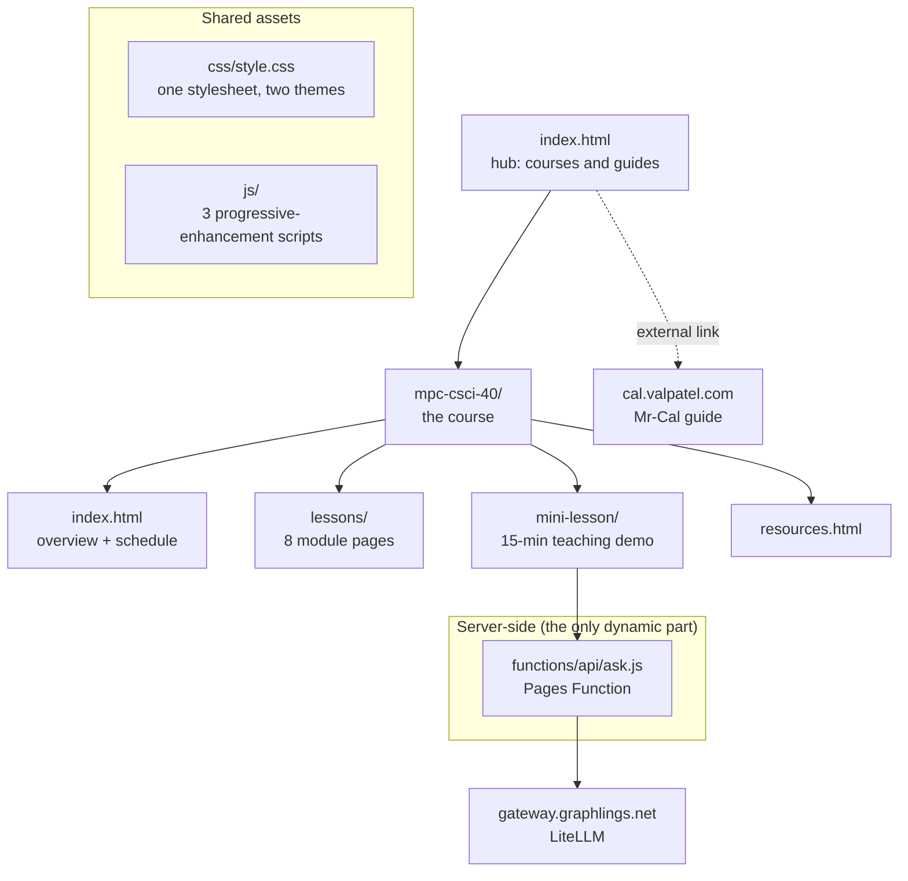

# lessons.mattvalancy.com

Central hub for course, study, and lesson material by
[Matthew Valancy](https://valpatel.com).

Live site: **<https://lessons.mattvalancy.com>**

The first course is **CSCI 40: Introduction to AI Tools** (Monterey Peninsula
College). The hub also links out to the
[Mr-Cal robot sensor calibration guide](https://cal.valpatel.com/).

> **The CSCI 40 course has not been taught.** This site was built as part of
> the interview process for the position. Every page under `mpc-csci-40/`
> says so at the top. It is an independent instructor site, not an official
> MPC publication.

## Layout



| Path | What it is | Docs |
|---|---|---|
| `index.html` | Hub landing page | — |
| `mpc-csci-40/` | The CSCI 40 course | [README](mpc-csci-40/README.md) |
| `mpc-csci-40/lessons/` | Eight module lesson plans | [README](mpc-csci-40/lessons/README.md) |
| `mpc-csci-40/mini-lesson/` | The 15-minute teaching demo | [README](mpc-csci-40/mini-lesson/README.md) |
| `css/` | The single stylesheet and its design tokens | [README](css/README.md) |
| `js/` | Client-side behaviour | [README](js/README.md) |
| `functions/` | Cloudflare Pages Functions (the live AI demo) | [README](functions/README.md) |
| `AGENTS.md` | Rules and hard-won gotchas for anyone editing this repo | [AGENTS.md](AGENTS.md) |

Future courses get their own top-level directory alongside `mpc-csci-40/`.

## How it's built

Plain static HTML and CSS with no framework, no bundler, and no build step.
The only JavaScript is three small dependency-free files, all progressive
enhancement — every page stays readable with JS disabled.

The one dynamic piece is `functions/api/ask.js`, a Cloudflare Pages Function
powering the mini-lesson's live "try it yourself" model widget. It exists so
the LLM gateway key stays server-side rather than shipping to the browser from
a public repo.

## Local preview

Pages use root-relative links, so serve the repo root — don't open files
directly.

```sh
python3 -m http.server 8000
# → http://localhost:8000
```

That serves **static files only**. To exercise `/api/ask` too, you need
Wrangler (Pages Functions + KV):

```sh
cp .dev.vars.example .dev.vars   # add a real gateway key
npx wrangler pages dev . --port 8788 --kv RATE_LIMIT_KV
```

`.dev.vars` is gitignored. Never commit real key values.

## Deployment

Cloudflare Pages, project `lesson-plans`, deployed straight from this repo:

- **Build command:** none
- **Build output directory:** `/` (repo root)
- **Custom domain:** `lessons.mattvalancy.com`

Every push to `main` publishes automatically.

**Required secrets** (Pages → Settings → Environment variables, or
`npx wrangler pages secret put <NAME> --project-name lesson-plans`):

| Name | Value |
|---|---|
| `GRAPHLING_GATEWAY_KEY` | LiteLLM virtual key, scoped to the small model tier and rate-limited |
| `GRAPHLING_MODEL_SMALL` | Model tier name, currently `graphling-small` |

**Required binding**, declared in `wrangler.toml` and picked up automatically
on git-connected deploys:

```toml
[[kv_namespaces]]
binding = "RATE_LIMIT_KV"
id = "<workers kv namespace id>"
```

> **Changing JS or CSS? Bump the `?v=` query on its `<script>` / `<link>`
> tags.** Pages serves those assets with a 4-hour `max-age`, so the custom
> domain will keep handing out the old file long after a deploy — while the
> deployment URL looks correct. This has bitten us; see
> [`AGENTS.md`](AGENTS.md).

## The live AI demo

The mini-lesson page ends with a terminal wired to a real 1.5-billion-parameter
model running on private hardware, reached through the Graphlings AI gateway.
Ask it something obscure and it will confabulate on cue — which is the lesson.

The full architecture, the two-layer rate limiting, the error taxonomy, and the
outage that shaped them are written up in
[`functions/README.md`](functions/README.md). This deployment is also the
worked example behind the Graphlings case study on consuming that gateway from
a web app.

## License

Course content © Matthew Valancy. Feel free to learn from the structure;
please don't republish the lesson content wholesale.
