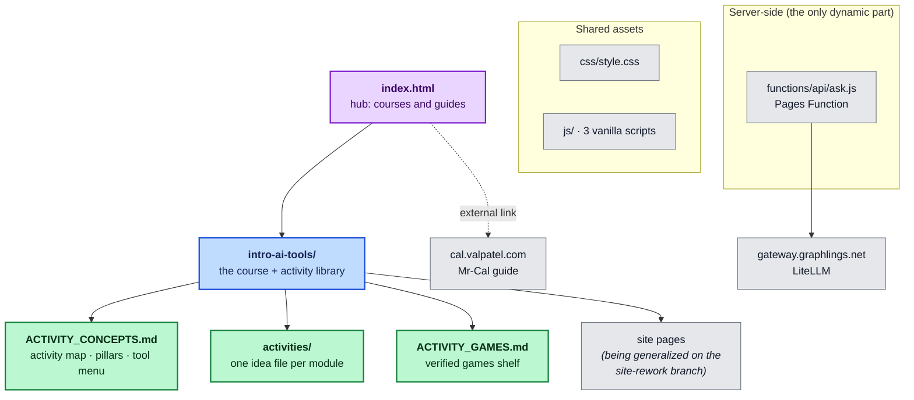

# lessons.mattvalancy.com

Central hub for course, study, and lesson material by
[Matthew Valancy](https://valpatel.com). Built to host **several classes**; the first is
**Introduction to AI Tools** — a community-college **skills development program** that
maps AI literacy to real job skills using the tools employers actually name
(Canva/Figma, Excel/Sheets, Zapier, GitHub, Cloudflare).

Live site: **<https://lessons.mattvalancy.com>** · The hub also links out to the
[Mr-Cal robot sensor calibration guide](https://cal.valpatel.com/).

## The course in one paragraph

Eight modules across ten 3-hour evening sessions, for a general audience with no coding
background — computer novices through engineering students in the same room. Aligned
with the MPC CSCI 40 outline but general-purpose: any school (or no school) can teach
from it, with no course-management system required. Three pillars shape every session:
**agency** (students decide whether and how to use AI), **ownership** (owners, not
customers — understand what AI is made of, run a model on your own hardware, publish
your own artifacts), and **humanization** (AI earns its place by freeing time for
people, never by turning people into numbers).

## Start here

| For… | Read |
|---|---|
| The activity idea library (per-module, job-skills mapped) | [`intro-ai-tools/ACTIVITY_CONCEPTS.md`](intro-ai-tools/ACTIVITY_CONCEPTS.md) |
| One deep idea file per module | [`intro-ai-tools/activities/`](intro-ai-tools/activities/README.md) |
| Verified browser games & explorables, by module | [`intro-ai-tools/ACTIVITY_GAMES.md`](intro-ai-tools/ACTIVITY_GAMES.md) |
| Mixed-ability teaching structures | [`intro-ai-tools/activities/teaching-scaffold.md`](intro-ai-tools/activities/teaching-scaffold.md) |
| Repo conventions & hard rules | [`AGENTS.md`](AGENTS.md) |

## Layout

## Current status

- **The activity library** (`intro-ai-tools/ACTIVITY_CONCEPTS.md`, `activities/`,
  `ACTIVITY_GAMES.md`) is on `main` — researched from ~20 parallel agent sweeps of real
  AI-literacy courses and playable explorables, every link fetch-verified, every module
  opening with a "Maps to job skills" line.
- **The site generalization** (MPC-specific framing → general public course, with
  redirects, restyled pages, and updated docs) is complete on the
  [`site-rework` branch](https://github.com/mvalancy/lesson-plans/tree/site-rework) and
  ready to merge; merging deploys it via Cloudflare Pages. Until then the live site
  shows the earlier course pages.
- The site serves directly from this repo (Cloudflare Pages, no build step): plain HTML,
  one stylesheet, dependency-free JS, and one Pages Function (`/api/ask`) that fronts a
  self-hosted LiteLLM gateway — itself a teaching prop for the course's "what is an AI
  gateway?" demo.

## Course facts

- 8 modules: What is AI? · Everyday Productivity · Images, Audio & Video · Spreadsheets
  & Data · Research & Information · Ethics & Bias · Automation · Capstone Showcase
  (3 sessions).
- Session rhythm: warm-up → lecture/demo → ~95-minute hands-on lab → wrap-up; scaffolded
  show → assist → solo, with a floor for novices and a stretch for engineers in every
  activity.
- Assessment leans on hands-on labs and a capstone graded on process: iteration
  evidence, verification quality, and being able to explain your own work.
