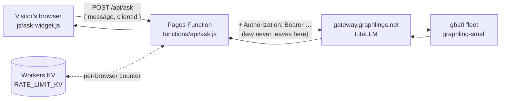
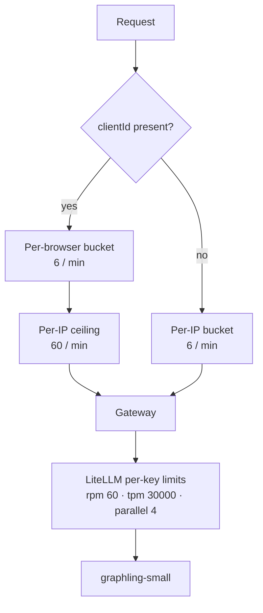

# `functions/` — Cloudflare Pages Functions

The only server-side code in this repo. Everything else is static.

Cloudflare Pages turns each file under `functions/` into an endpoint
automatically, matching the file path. No build step, no router config.

| File | Endpoint | Purpose |
|---|---|---|
| `api/ask.js` | `POST /api/ask` | Proxies one question to the Graphlings LLM gateway for the mini-lesson's live demo widget |

## Why a Function exists at all

The demo widget needs to call an LLM. It cannot do that from the browser,
because that would mean shipping the gateway API key to every visitor of a
**public repo and a public page**. The Function is the smallest thing that
keeps the key server-side:



Same-origin also means no CORS to configure, and the client can never choose
the model, the token budget, or the system prompt.

## What `api/ask.js` enforces

Read the file — it is short and commented — but in summary:

- **Model is pinned server-side.** A client-supplied `model` field is ignored.
  The name comes from the `GRAPHLING_MODEL_SMALL` binding, which is a *tier*
  alias (`graphling-small`), so swapping the underlying model needs no change
  here.
- **Input caps**: 300 characters in, 150 tokens out, 30s upstream timeout.
- **Two rate-limit layers** — see [Rate limiting](#rate-limiting).
- **Errors carry a stable `code`** so a failure is diagnosable rather than
  mysterious. The taxonomy is documented in a comment above `fail()`.

## Rate limiting

Two layers, deliberately different scopes:



**Per-browser, not per-IP.** A classroom sits behind one NAT; an IP-only
bucket would give thirty students six questions a minute *between them*. The
widget sends a random id it keeps in `localStorage`. That id is **not a
security boundary** — it only decides which bucket you land in. Rotating it
is bounded by the per-IP ceiling above it.

**The KV limiter is best-effort.** `get`-then-`put` is not atomic, so a
concurrent burst can slip past the check. That is acceptable only because the
gateway's own per-key limits are the real ceiling and shed load as a graceful
`429`. Do not remove those on the assumption this layer is authoritative.

## Bindings

Set in the Cloudflare dashboard / `wrangler.toml`, never in the repo:

| Binding | Type | Purpose |
|---|---|---|
| `GRAPHLING_GATEWAY_KEY` | secret | LiteLLM virtual key, scoped to the small model |
| `GRAPHLING_MODEL_SMALL` | secret | Model tier name, currently `graphling-small` |
| `RATE_LIMIT_KV` | KV namespace | Per-browser / per-IP counters |

## Local development

The plain `python3 -m http.server` used for the static pages **does not run
Functions**. Use Wrangler:

```sh
cp .dev.vars.example .dev.vars   # add a real key
npx wrangler pages dev . --port 8788 --kv RATE_LIMIT_KV
```

`.dev.vars` is gitignored. Never commit real key values.

## Gotchas learned the hard way

- **All widget traffic reaches the gateway from a shared Cloudflare Worker
  egress IP**, not the visitor's. Anything at the gateway that keys off client
  IP therefore sees every visitor as one client. This once caused an autoban
  that took the demo offline. See the root [`AGENTS.md`](../AGENTS.md).
- **Don't load-test this endpoint against production.** Same reason.
