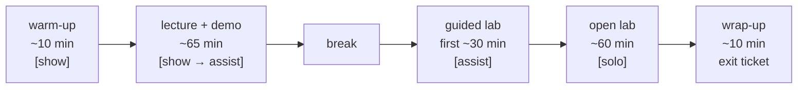
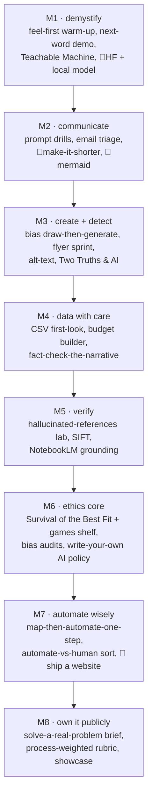
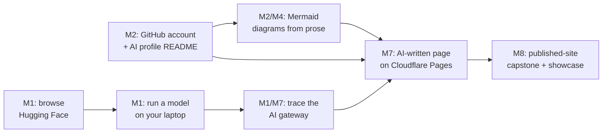

# Activity Map — Introduction to AI Tools

Brainstorming-level map of classroom activities for the course's eight modules (aligned
with the MPC CSCI 40 outline, but general-purpose — usable by any school, no course
management system required). This page is the spitball overview; each module links to a
sub-file holding the full researched menu, structured so one research agent can deepen
one lesson at a time.

| Module | Idea file |
|---|---|
| 1 · What is AI? | [activities/01-what-is-ai.md](activities/01-what-is-ai.md) |
| 2 · Everyday Productivity | [activities/02-everyday-productivity.md](activities/02-everyday-productivity.md) |
| 3 · Images, Audio, Video | [activities/03-images-audio-video.md](activities/03-images-audio-video.md) |
| 4 · Spreadsheets & Data | [activities/04-spreadsheets-data.md](activities/04-spreadsheets-data.md) |
| 5 · Research & Information | [activities/05-research-information.md](activities/05-research-information.md) |
| 6 · Ethics & Bias | [activities/06-ethics-bias.md](activities/06-ethics-bias.md) |
| 7 · Automation | [activities/07-automation.md](activities/07-automation.md) |
| 8 · Capstone Showcase | [activities/08-capstone.md](activities/08-capstone.md) |
| — · Teaching scaffold (cross-cutting) | [activities/teaching-scaffold.md](activities/teaching-scaffold.md) |
| — · Games & interactives | ACTIVITY_GAMES.md *(in progress)* |

## The three pillars

Every activity gets filtered through these:

1. **Agency** — students decide *whether and how* to use AI, not just how (Winthrop:
   explore how students think and feel about AI before they use anything; "when not to
   use AI" is an explicit line in every rubric).
2. **Ownership** — owners, not customers. Local AI is commoditizing (today's iPad Pro /
   high-end MacBook already runs serious models); students learn what tools are made of
   (models, datasets, gateways), run one on their own hardware, and publish their own
   artifacts on the open web.
3. **Humanization** — AI earns its place by removing the tasks that keep us from
   appreciating people, never by turning people into numbers. Use AI to be more concise
   (the one-pager the reader wants), not to inflate.

## The scaffold

Tags used throughout: `[show]` instructor demo ("I do") → `[assist]` guided lab ("we
do") → `[solo]` independent work ("you do"). Every entry carries a **floor** (novice
entry point) and a **stretch** (engineer-depth extension) — same task, no visible tracks.

## Top-level activity map

The short list — the picks per module that best hit diverse audience + ethics core +
empowerment. 🌟 = instructor-seeded. Full menus (≈20 options per module) in the
sub-files.

- **M1 What is AI** — K-H-W-L / Hopes & Concerns warm-up (agency-first, before any tool
  use); predict-the-next-word demo; Teachable Machine bias-your-own-classifier;
  🌟 Hugging Face tour + 🌟 run a local model (ownership made tangible); Warming Up to AI
  low-stakes first prompts for psychological safety.
- **M2 Everyday Productivity** — bad→good prompt drill; email rewrite triage (real
  workplace stakes); 🌟 make-it-shorter (humanization: respect the reader's time);
  🌟 Mermaid diagrams (validatable output, small-model-friendly); prompt battle for fun.
- **M3 Images/Audio/Video** — draw-then-generate scientist bias check; workplace
  flyer/logo sprint (community empowerment); AI alt-text draft-and-revise
  (accessibility = humanization); Two Truths & AI + Detect Fakes for detection instinct.
- **M4 Spreadsheets & Data** — CSV first-look profile; household budget builder
  (personal buy-in); AI fact-check-the-data-narrative closer (verification habit);
  code-verified number check ("don't trust freehand arithmetic").
- **M5 Research & Information** — hallucinated-references lab (quantify the fix!);
  lateral reading / SIFT modeled live; NotebookLM source-grounding contrast; privacy
  policy comparison (what happens to pasted data).
- **M6 Ethics & Bias** — Survival of the Best Fit + the whole games shelf; image-generator
  bias audit students run themselves; draft-your-own AI use policy (agency as artifact);
  disclosure ladder; energy/water footprint.
- **M7 Automation** — map your workflow then automate ONE step; automate-vs-keep-human
  card sort (humanization line-drawing); custom GPT/Project for one job task; 🌟 ship a
  real website (GitHub → AI-written page → Cloudflare Pages).
- **M8 Capstone** — "solve a problem in your life or job" brief; process-weighted rubric
  (iteration evidence beats polish; verification and authorial mastery graded); 3-session
  arc: kickoff → gallery-walk check-in → showcase (stations or lightning talks);
  🌟 published-site capstone — every project is a real URL.

## Course-long threads

Recurring threads: **personal AI-tool repository ranked on ethics & effectiveness** (one
tool per module → capstone appendix); **verification habit** (every module has one
"catch the AI being wrong" moment); **portfolio** (one artifact per module feeds the
capstone); **games shelf** (one playable warm-up per session, drawn from
ACTIVITY_GAMES.md).

## Tool menu — current apps with free plans, by category

**The category is the curriculum; the vendor is an example.** Each activity names a tool
*category* and offers 2–3 current examples with free tiers students can actually try.
When a better tool comes along, swap the example, keep the activity. (Free-tier terms
change constantly — verify before each term; the site's resources page carries the
canonical, maintained list.)

| Category (what the skill is) | Current examples with free plans (mid-2026 — verify) |
|---|---|
| Chat assistant / general LLM | Claude, ChatGPT, Gemini — free tiers; pick any |
| Local AI (ownership thread) | LM Studio, Ollama — fully free, run on your own hardware |
| Open-model ecosystem | Hugging Face — free account, Spaces demos |
| Design & visual communication | Canva (free + edu), **Figma** (free starter + free edu; now with AI features), Microsoft Designer |
| Presentations | Gamma (free tier), Canva, Google Slides + Gemini |
| Image generation | Whatever's bundled free in the chat assistants above; Adobe Firefly free tier |
| Audio: transcription | Otter.ai free tier; Whisper (free, local — ties to ownership) |
| Audio: voice & music | ElevenLabs free tier, Suno free tier |
| Video editing | CapCut free tier, Clipchamp (bundled with Windows) |
| Meeting/writing polish | Grammarly free tier; built-in AI in Gmail/Outlook/Docs |
| Research (grounded) | NotebookLM (free), Perplexity free tier |
| Data / notebooks | Google Colab free tier, Google Sheets + Gemini, Excel free web version |
| Automation | Zapier free tier, Make free tier, n8n (free self-host) |
| Publish & build (ownership thread) | GitHub (free), Cloudflare Pages (free), itch.io (free), Twine (free) |

Rule for fitting these into lessons: a tool earns its slot by serving an activity and a
pillar — never "here's an app, go play." Figma, for example, enters through the Module 3
design-brief activities (flyer/logo/deck) as the professional-grade option next to
Canva's low floor, and through Module 8 portfolios — not as a standalone lesson.

## Cross-course patterns worth adopting (from a sweep of 12 comparable courses)

- **Low-stakes weekly quiz + one hands-on activity per module** (Andrew Ng's
  [AI For Everyone](https://www.coursera.org/learn/ai-for-everyone)) fits a short course
  far better than papers.
- **"Personal repository of AI tools, ranked on ethics and effectiveness"** — a ready-made
  running assignment. ([Ethical AI: AI Essentials for Everyone](https://www.coursera.org/learn/ethical-ai-ai-essentials-for-everyone))
- **Iterative refine-and-regenerate labs** beat one-shot prompting assignments.
  ([Prompt Engineering for AI Image Generation](https://www.coursera.org/learn/prompt-engineering-ai-image-generation-lo095035))
- **Portfolio-as-capstone** — one artifact per module accumulates into a presented
  portfolio. ([CCNY AI for Business Productivity](https://www.ccny.cuny.edu/cps/ai-business-productivity))
- **Tool-agnostic activity menus** — offer a menu of tools, never one vendor; survives
  tool churn. ([Google AI Essentials](https://grow.google/ai-essentials/))
- **TA/helper-staffed hands-on time, zero homework** — all practice in-session.
  ([Caltech CTME AI Tools for Everyone](https://ctme.caltech.edu/artificial-intelligence-tools-for-everyone.html))
- **Ethics-first ordering** — put ethics *before* the tool tour. ([LinkedIn/Microsoft Career Essentials in Generative AI](https://www.linkedin.com/learning/paths/career-essentials-in-generative-ai-by-microsoft-and-linkedin))
- **"Run, don't write, the code"** — pre-built cells; learners hit run and swap the
  prompt. ([DeepLearning.AI Generative AI for Everyone](https://www.deeplearning.ai/courses/generative-ai-for-everyone))
- **Environmental impact inside the ethics module** — largely absent elsewhere.
  ([GVSU AI Literacy for Life & Work](https://www.gvsu.edu/gvnext/2026/gvsu-launches-free-ai-literacy-course-for-community-learners.htm))
- **Discussion bookends** — icebreaker + closing reflection; cheap, near-universal, works
  on paper or a whiteboard (no LMS needed).
- **Rubric-plus-revision capstone grading** ([Foothill LINC 51F](https://catalog.foothill.edu/course-outlines/LINC-51F/), same CC system).

## Provenance & link hygiene

Entries in the sub-files marked *(adapted)* combine real tools/techniques into classroom
formats not documented as a single named lesson; unmarked entries come from documented
courses/curricula, each with source links. All ~165 links were checked live on
2026-08-22 (a handful of major sites block automated checks — Canva, OpenAI, Medium,
Taylor & Francis, EDUCAUSE — and are flagged in place where verification wasn't
possible). Keep it this way: verify every new link before it lands here.
