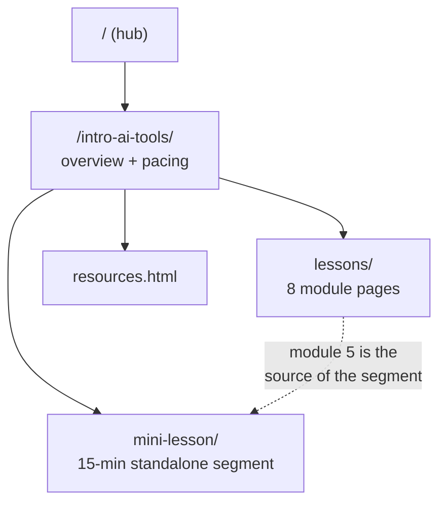

# Introduction to AI Tools

A free, self-paced course on using — and owning — AI tools, written for people
with no coding background.

> **Free to learn from, free to teach from.** This is a standalone public
> course guide. There is no enrolment, no term, and no institution behind it.
> Every page here opens with the `.site-note` saying so — see
> [Conventions](#conventions).

Live: <https://lessons.mattvalancy.com/intro-ai-tools/>

Previously published at `/mpc-csci-40/`; those URLs 301 here via the repo-root
[`_redirects`](../_redirects) file.

## Contents

| Path | What it is |
|---|---|
| `index.html` | Course overview, the three commitments, module grid, suggested pacing |
| `lessons/` | One page per module — [see `lessons/README.md`](lessons/README.md) |
| `mini-lesson/` | A 15-minute standalone segment — [see `mini-lesson/README.md`](mini-lesson/README.md) |
| `resources.html` | Free tools, open models, and the per-module tool list |
| `ACTIVITY_CONCEPTS.md` | The activity map: pillars, scaffold, tool menu, per-module top picks |
| `activities/` | The idea library, one file per module — [see `activities/README.md`](activities/README.md) |
| `ACTIVITY_GAMES.md` | Verified shelf of browser games/explorables, grouped by module |

## The three commitments

Every module is shaped by three ideas. They are the difference between this
course and a tour of somebody's product menu:

- **Agency** — the first question is *whether* to use an AI tool for a given
  task, not just how. Declining well is a taught skill.
- **Ownership** — readers are owners, not customers. Consumer hardware already
  runs capable models; open ecosystems (Hugging Face, Ollama) and open
  publishing (GitHub, Cloudflare Pages) are how you keep what you make. Local
  AI is commoditising, and the course exists to get people ahead of that.
- **Humanization** — AI should make people more human, not less. Automate the
  drudgery so attention goes to people; send the one-pager somebody actually
  wanted rather than a generated thousand words; never let a system quietly
  turn a person into a number.

Say each of these once, clearly, and then get back to the work. Preaching is
off-tone.

## Course facts

- **8 modules**, written for **3-hour sessions**: a short lecture, then a much
  longer hands-on lab. Ten sessions is a comfortable pace — the capstone spans
  three of them.
- The 3-hour rhythm is pedagogical and stays. Dates, terms, unit counts, and
  grading policies are institutional and do not belong here.
- Audience: **anyone, no coding background**.
- Recommended free text: *Elements of AI* (elementsofai.com).

**Learning outcomes:**

1. Use AI tools to complete tasks in writing, research, data analysis, and
   creative expression.
2. Evaluate AI outputs for accuracy, bias, and ethical implications.
3. Own what you build with them — understand the parts, know the alternatives,
   and keep the result.
4. Decide when *not* to use them at all.

## Structure

The eight modules map to ten suggested sessions — the capstone spans the last
three:

| Module | Sessions | Topic |
|---|---|---|
| 1 | 1 | What is AI? Past, Present, and Future |
| 2 | 2 | Generative AI for Everyday Productivity |
| 3 | 3 | Working with AI Images, Audio, and Video |
| 4 | 4 | AI and Data: Spreadsheets & Visualization |
| 5 | 5 | AI for Research and Information Gathering |
| 6 | 6 | Ethics, Bias, and Responsible AI |
| 7 | 7 | Automation with AI Assistants |
| 8 | 8 · 9 · 10 | Capstone Showcase |

## Conventions

- **The `.site-note` is mandatory.** Every page here opens with it as the
  first element in `<body>`: free, self-paced, learnable and teachable by
  anyone, unaffiliated. New pages must include it.
- **No institutional framing.** No school names, course codes, logos, term
  dates, unit counts, grading bases, or enrolment logistics. Modules, never
  dated sessions.
- **Tone**: plain language, welcoming to non-programmers, professional rather
  than preachy.
- Nav and footer are duplicated per page (no templating). Change one, change
  all.
- Content blocks inside `<main>` are wrapped in `<section class="reveal">` so
  `js/lesson-reveal.js` can fade them in on scroll. Pages stay fully readable
  without JavaScript.
