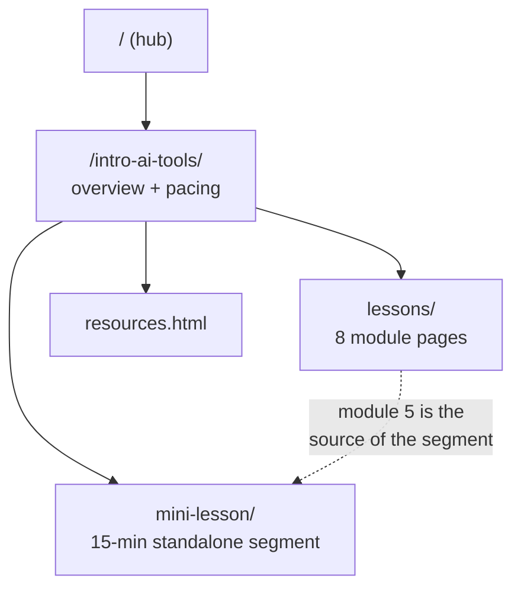

# Introduction to AI Tools

A free, self-paced course on using — and owning — AI tools, written for people with no
coding background. As a **skills development program** it maps every module to named
job skills, built on the tools employers actually use (Canva/Figma, Excel/Sheets,
Zapier, GitHub, Cloudflare); computer novices and engineers work the same labs at
different depths.

> **Free to learn from, free to teach from.** This is a standalone public course guide.
> There is no enrolment, no term, and no institution behind it. Every page here opens
> with the `.site-note` saying so — see [Conventions](#conventions).

Live: <https://lessons.mattvalancy.com/intro-ai-tools/>

Previously published at `/mpc-csci-40/`; those URLs 301 here via the repo-root
[`_redirects`](../_redirects) file.

**Industry alignment:** the program is designed for review by a panel of industry
experts. Each module's "Maps to job skills" line (in [`activities/`](activities/)) is
the review artifact — panelists confirm, strike, or add skills in plain language, and
the activity menus adapt without restructuring the course. The tool menu is
category-first for the same reason: when the panel says "our shop uses X now," the
example swaps and the skill stays.

## Contents

| Path | What it is |
|---|---|
| `index.html` | Course overview, the three commitments, module grid, suggested pacing |
| `lessons/` | One page per module — [see `lessons/README.md`](lessons/README.md) |
| `mini-lesson/` | A 15-minute standalone segment with the live model widget — [see `mini-lesson/README.md`](mini-lesson/README.md) |
| `resources.html` | The resource library: side index, ~66 verified games, free tools by category, dataset shelf, build-your-own templates |
| `ACTIVITY_CONCEPTS.md` | The activity map: pillars, scaffold, tool menu, per-module top picks |
| `activities/` | The idea library + [lab playbook](activities/lab-playbook.md) — [see `activities/README.md`](activities/README.md) |
| `ACTIVITY_GAMES.md` | Verified shelf of browser games/explorables, grouped by module |
| `flyers/` | Hook flyers and title banners, print-light and screen-dark — [see `flyers/README.md`](flyers/README.md) |

## The three commitments

Every module is shaped by three ideas. They are the difference between this course and
a tour of somebody's product menu:

- **Agency** — the first question is *whether* to use an AI tool for a given task, not
  just how. Declining well is a taught skill.
- **Ownership** — readers are owners, not customers. Consumer hardware already runs
  capable models; open ecosystems (Hugging Face, Ollama) and open publishing (GitHub,
  Cloudflare Pages) are how you keep what you make. Local AI is commoditising, and the
  course exists to get people ahead of that.
- **Humanization** — AI should make people more human, not less. Automate the drudgery
  so attention goes to people; send the one-pager somebody actually wanted rather than
  a generated thousand words; never let a system quietly turn a person into a number.

Say each of these once, clearly, and then get back to the work. Preaching is off-tone.

## Course facts

- **8 modules**, written for **3-hour sessions**: a short lecture, then a much longer
  hands-on lab. Ten sessions is a comfortable pace — the capstone spans up to three.
- The 3-hour rhythm is pedagogical and stays. Dates, terms, unit counts, and grading
  policies are institutional and do not belong here.
- Audience: **anyone, no coding background**.
- Recommended free text: *Elements of AI* (elementsofai.com), the free course from
  the University of Helsinki and MinnaLearn. No affiliation, we just think it teaches
  well.

**Learning outcomes:**

1. Use AI tools to complete tasks in writing, research, data analysis, and creative
   expression.
2. Evaluate AI outputs for accuracy, bias, and ethical implications.
3. Own what you build with them — understand the parts, know the alternatives, and
   keep the result.
4. Decide when *not* to use them at all.

## The eight modules

| # | Module | Sessions | Job-skills headline |
|---|---|---|---|
| 1 | What is AI? Past, Present, and Future | 1 | AI literacy · tool evaluation · verifying output |
| 2 | Generative AI for Everyday Productivity | 2 | prompt craft · business writing · documentation |
| 3 | Working with AI Images, Audio, and Video | 3 | content production · accessibility · media verification |
| 4 | AI and Data: Spreadsheets & Visualization | 4 | spreadsheet analysis · data cleaning · report auditing |
| 5 | AI for Research and Information Gathering | 5 | fact-checking · research synthesis · information governance |
| 6 | Ethics, Bias, and Responsible AI | 6 | policy drafting · bias auditing · vendor due diligence |
| 7 | Automation with AI Assistants | 7 | workflow automation · process mapping · web publishing |
| 8 | Capstone Showcase | 8 · 9 · 10 | project scoping · portfolio building · presenting work |

## Structure

## Conventions

- **The `.site-note` is mandatory.** Every page here opens with it as the first element
  in `<body>`: free, self-paced, learnable and teachable by anyone, unaffiliated. New
  pages must include it.
- **No institutional framing.** No school names, course codes, logos, term dates, unit
  counts, grading bases, or enrolment logistics. Modules, never dated sessions.
- **Tone**: plain language, welcoming to non-programmers, professional rather than
  preachy.
- Nav and footer are duplicated per page (no templating). Change one, change all.
- Content blocks inside `<main>` are wrapped in `<section class="reveal">` so
  `js/lesson-reveal.js` can fade them in on scroll. Pages stay fully readable without
  JavaScript.
