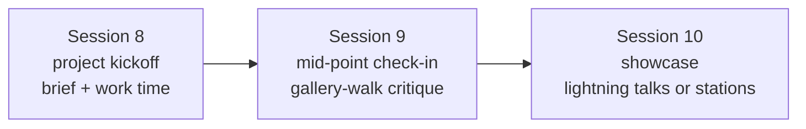

# Activity ideas: Module 8 — Capstone Showcase

Part of the [activity idea library](../ACTIVITY_CONCEPTS.md) — brainstorming
material, not finished lesson plans. Scaffold tags, floor/stretch notes, and the
three pillars (agency · ownership · humanization) are defined in the top-level map.

> **Deepening this file:** each module file is independent so a research agent can
> go deep on one lesson at a time. When adding ideas: keep the entry format, verify
> every link is live, mark inventions as *(adapted)*, and prefer activities with a
> low floor, a high ceiling, and a workplace or community tie-in.

A shape that fits the three allotted sessions, assembled from the formats below:

**Project formats**

- **Workplace task portfolio (Merit America model)** — Pick one real task from your job
  or job search; improve it with AI; present the artifact plus a "learning narrative."
  Weekly milestones: identify task + first prompt → working draft → test/refine → polish →
  present. [Merit America Workplace AI Essentials](https://meritamerica.org/career-tracks/workplace-ai-essentials/)
- **Choose-your-domain applied capstone (CPTC LEARNAI)** — Pick a domain (business,
  education, healthcare, trades); four stages: selection → planning → execution with a
  required process log + ethics notes → portfolio compilation. Domain choice creates the
  complexity gradient naturally. [CPTC LibGuide](https://cptc.libguides.com/TLC/LEARNAI-C6)
- **Propose-a-workplace-solution (WGU model)** — Design and *propose* (not necessarily
  build) an AI solution to a productivity challenge at your real or a hypothetical
  workplace; graded partly on ethical assessment of the recommendation. [WGU AI Skills Fundamentals](https://www.wgu.edu/online-it-degrees/certificates/ai-skills-fundamentals.html)
- **Demonstrate-3-capabilities constraint (Google/Kaggle model)** — Any use case you
  want, but the artifact must demonstrate ≥3 distinct capabilities learned in the course
  (e.g., prompting + image gen + a chart; or automation + custom bot + published site).
  Scales from novice chains to agentic pipelines. [Kaggle Gen AI capstone rules](https://www.kaggle.com/competitions/gen-ai-intensive-course-capstone-2025q1/rules)
- **"Solve a problem in your life or job" brief template** *(adapted synthesis — the
  pattern behind every CC/corporate capstone found)* — Problem → who has it → AI tools
  tried → what changed → what you'd still fix. This is the mechanism that lets a novice
  make a fundraiser flyer + chatbot while an engineer automates status reports, under one
  rubric.
- **Portfolio-as-capstone (CCNY model)** — One artifact per module accumulates all
  course long; the capstone sessions curate and present the collection. [CCNY AI for Business Productivity](https://www.ccny.cuny.edu/cps/ai-business-productivity)
- 🌟 **Published-site capstone** *(instructor-seeded)* — The Module 7 GitHub → Cloudflare
  thread lands here: every project ships as a real URL (project page, portfolio,
  small-business site) shared at the showcase. Ownership made literal.

**Showcase formats**

- **Two-part public event (DC Public Library model)** — Formal pod-by-pod stage
  presentations *plus* a separate open-house block with tabletop stations — decoupling
  "present to a panel" from "browse and chat." [DCPL AI upskilling showcase](https://dclibrary.libnet.info/event/14727518)
- **Interactive stations, no stage (ASU "Me|We in AI")** — Each team runs a hands-on
  station visitors walk up and try; naturally absorbs wildly different technical depth.
  [ASU showcase](https://tech.asu.edu/features/grad-students-host-AI-showcase)
- **Timed pitch + Q&A (courseweave demo day)** — 6-minute fixed arc (problem 1:00 →
  product 0:30 → live demo 2:30 → validation findings 1:00 → honest limitation + roadmap
  1:00) then 4 min Q&A. [courseweave week 10](https://www.courseweave.org/weeks/week-10/presentation/)
- **Lightning talks / PechaKucha** — Fixed slide count and auto-advance equalize stage
  time between simple and complex projects; grading centers on clarity. [Lightning talk format](https://en.wikipedia.org/wiki/Lightning_talk)
- **Digital gallery walk as the mid-point milestone** — Artifacts on a shared board;
  groups rotate leaving cumulative comments. Lower-pressure than presenting; mirrors
  async peer-review culture (Slack threads, PR comments). [Gallery walk guide](https://flipeducation.ai/blog/the-ultimate-guide-to-gallery-walks-engaging-every-student-in-active-learning)
- **Async gallery + "winners announced" moment** *(adapted from the Kaggle mechanic)* —
  Submissions posted to a shared public gallery; recognition at the final session.
  Removes live-speaking anxiety from the score entirely.

**Rubric ingredients**

- **Process-weighted grading** — courseweave weights *user-validation evidence* double
  the technical Q&A: "a team with a simple product and strong evidence of iteration
  outscores an impressive prototype with no evidence of learning." Rewards uncomfortable
  truths over smooth demos. [courseweave rubric](https://www.courseweave.org/weeks/week-10/presentation/)
- **Four-dimension AI-work rubric (UTA)** — Substantive quality, **verification
  quality**, **attribution completeness**, authorial mastery: if you can't explain how it
  was produced and defend it under questioning, you haven't met the standard regardless
  of surface polish. Pairs naturally with a Q&A component. [UTA Alchemy of Assessment](https://uta.pressbooks.pub/thealchemy/chapter/ai-rubrics/)
- **"Validated against reality" bolt-on rule** — Points for using AI to generate; points
  *lost* for not validating the output against reality (audience, data, a manual check).
  Works identically for a flyer and an automation.
- **Mid-point presentation as a required milestone** (NAF capstone skeleton) — maps
  session 9 to a graded check-in, not just a work session. [NAF capstone manual](https://naf.org/wp-content/uploads/2021/01/Capstone-Project-Student-Manual.pdf)
- **Badge/credential option (IBM SkillsBuild model)** — Completion issues a shareable
  LinkedIn-visible badge; the credential *is* the workplace tie-in. [Credly badge](https://www.credly.com/org/ibm-skillsbuild/badge/artificial-intelligence-fundamentals-with-capstone-)

