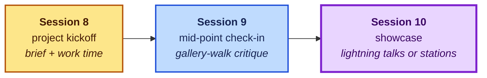

# Activity ideas: Module 8 — Capstone Showcase

Part of the [activity idea library](../ACTIVITY_CONCEPTS.md). Three sessions: kickoff,
mid-point critique, public showcase. The capstone should feel like *ownership in
public*: a real problem from the student's own life or job, solved with the course's
tools, published at a URL they keep.

**Maps to job skills:** project scoping · portfolio building (GitHub/live URL) ·
presenting work · iterating from user feedback

> **Scheduling note:** up to two of the three capstone sessions may be reassigned to
> other topics (guest lectures, special sessions — TBD). The arc below compresses
> gracefully: minimum viable is kickoff + showcase, with the mid-point gallery walk
> going async. Scope briefs assuming two sessions.

## Start here — the picks

### 1. The brief: solve a problem in your life or job · Session 8

Every capstone found in the research uses this shape — the student supplies the problem,
which is exactly what lets a novice and an engineer share one rubric.

**The template, five slots:**
1. **The problem** — and *who has it* (you, your team, your community group).
2. **AI tools tried** — at least two categories from the course.
3. **What changed** — before vs. after, honestly measured.
4. **What you'd still fix** — the honest-limitation slot, graded *up* not down.
5. **Where it lives** — the published artifact (see pick 4).

Worked examples across the range: a parent ships a fundraiser flyer + FAQ chatbot for
the school; a shop owner builds an intake form → auto-quote pipeline; an engineering
student automates their team's status reports. Same brief, same rubric.
Sources: pattern across [Merit America](https://meritamerica.org/career-tracks/workplace-ai-essentials/), [CPTC LEARNAI](https://cptc.libguides.com/TLC/LEARNAI-C6), [WGU](https://www.wgu.edu/online-it-degrees/certificates/ai-skills-fundamentals.html) *(adapted synthesis)*

### 2. The rubric: grade the process, not the polish

Two research-backed pieces, combined:

- **Process-weighted scoring** ([courseweave demo-day rubric](https://www.courseweave.org/weeks/week-10/presentation/)):
  user-validation evidence weighs *double* the technical Q&A — "a team with a simple
  product and strong evidence of iteration outscores an impressive prototype with no
  evidence of learning." Reward the uncomfortable truth ("testers couldn't finish the
  task, so we redesigned it") over the smooth demo.
- **The four dimensions** ([UTA Alchemy of Assessment](https://uta.pressbooks.pub/thealchemy/chapter/ai-rubrics/)):
  substantive quality · **verification quality** · **attribution completeness** ·
  authorial mastery — if you can't explain how it was produced and defend it under
  questioning, you haven't met the standard, regardless of surface polish.

Suggested weights: artifact 30 · iteration/validation evidence 30 · verification &
attribution 20 · presentation 20. Add the bolt-on rule: points *lost* for any AI output
never validated against reality (audience, data, a manual check).

### 3. The three-session arc

- **Session 8 — kickoff:** brief approved in a five-minute conversation per student
  (scope-check: novices get scoped up in confidence, engineers scoped down to
  finishable), then open work time with the instructor circulating.
- **Session 9 — mid-point gallery walk:** work-in-progress on screens around the room;
  rotating groups leave structured sticky-note feedback ("one thing that works · one
  question · one idea"). This is a *graded milestone* (the NAF capstone model), and it
  is deliberately lower-pressure than presenting — it mirrors async peer review at work.
- **Session 10 — showcase, two formats to choose:** *lightning talks* (fixed slide
  count and time — the equalizer between simple and complex projects), or *stations*
  (ASU's "Me|We" model: visitors walk up and try each project — absorbs wildly different
  technical depth). An async-gallery + "winners announced" option removes live-speaking
  anxiety from the score entirely for students who need it.

Sources: [NAF capstone manual](https://naf.org/wp-content/uploads/2021/01/Capstone-Project-Student-Manual.pdf), [ASU showcase](https://tech.asu.edu/features/grad-students-host-AI-showcase), [DCPL two-part event](https://dclibrary.libnet.info/event/14727518), [Lightning talks](https://en.wikipedia.org/wiki/Lightning_talk)

### 4. 🌟 Published-site capstone: every project is a URL

The Module 7 pipeline (GitHub → AI-written page → Cloudflare Pages) lands here: each
project ships as a live page — the project itself, or a one-page write-up of it — and
the showcase ends with a link list on the course hub. Students leave the course with a
public artifact an employer can click. Ownership made literal.

**The stretch-stretch tier:** build a game. Survival of the Best Fit — the course's
anchor activity — *was four students' class project* before it won a Mozilla award. The
[games shelf's Module 8 section](../ACTIVITY_GAMES.md#module-8--capstone-build-our-own)
has the license-checked build paths and forkable templates (Parable of the Polygons is
CC0 with no build step). A student-built teaching game about AI hallucination — the gap
no existing game covers — would be a genuine contribution.

## Full menu

| Format | The gist | Source |
|---|---|---|
| **Workplace task portfolio** | One real task from your job or job search, improved with AI across weekly milestones; present artifact + a "learning narrative." | [Merit America](https://meritamerica.org/career-tracks/workplace-ai-essentials/) |
| **Choose-your-domain capstone** | Pick a domain (business, education, healthcare, trades); four stages with a required process log + ethics notes. | [CPTC LEARNAI](https://cptc.libguides.com/TLC/LEARNAI-C6) |
| **Propose-a-solution** | Design and *propose* (not build) an AI solution for a real or hypothetical workplace; graded partly on the ethical assessment. | [WGU](https://www.wgu.edu/online-it-degrees/certificates/ai-skills-fundamentals.html) |
| **Demonstrate-3-capabilities** | Any use case, but the artifact must show ≥3 distinct capabilities from the course. Scales novice → agentic. | [Kaggle capstone rules](https://www.kaggle.com/competitions/gen-ai-intensive-course-capstone-2025q1/rules) |
| **Portfolio-as-capstone** | One artifact per module accumulates all course; capstone sessions curate and present the collection. | [CCNY](https://www.ccny.cuny.edu/cps/ai-business-productivity) |
| **Two-part public event** | Formal stage presentations *plus* an open-house block with tabletop stations — presenting and browsing, decoupled. | [DCPL](https://dclibrary.libnet.info/event/14727518) |
| **Badge/credential option** | Completion issues a shareable LinkedIn-visible badge; the credential is the workplace tie-in. | [IBM SkillsBuild/Credly](https://www.credly.com/org/ibm-skillsbuild/badge/artificial-intelligence-fundamentals-with-capstone-) |
| **Rubric-plus-revision grading** | Capstone graded against a rubric *with revision opportunities* — same CC system (Foothill). | [Foothill LINC 51F](https://catalog.foothill.edu/course-outlines/LINC-51F/) |

> **Living document:** each module file stands alone and grows over time as new ideas
> are researched. Keep the entry format, verify every link is live, mark inventions as
> *(adapted)*, prefer low floor + high ceiling + a workplace or community tie-in.
