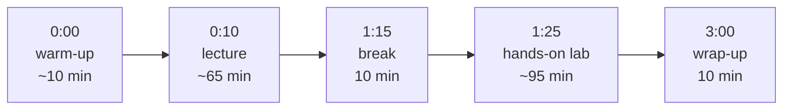

# `lessons/` — the eight module pages

One page per module. Each is a **lesson plan**, not a handout: written for
whoever is teaching to teach from, and for a self-paced learner to work
through alone.

| File | Module | Sessions |
|---|---|---|
| `01-what-is-ai.html` | What is AI? Past, Present, and Future | 1 |
| `02-everyday-productivity.html` | Generative AI for Everyday Productivity | 1 |
| `03-images-audio-video.html` | Working with AI Images, Audio, and Video | 1 |
| `04-spreadsheets-data.html` | AI and Data: Spreadsheets & Visualization | 1 |
| `05-research-information.html` | AI for Research and Information Gathering | 1 |
| `06-ethics-bias.html` | Ethics, Bias, and Responsible AI | 1 |
| `07-automation.html` | Automation with AI Assistants | 1 |
| `08-capstone.html` | Capstone Showcase | 3 |

## The page skeleton

**Every lesson page follows the same section order.** Keep it when editing —
consistency is what makes them usable as a set:

1. **Header** — module number out of eight, plus the session shape
2. **Overview** — a paragraph on why the module matters
3. **Learning objectives** — in an `.objectives` block
4. **Session agenda** — an `.agenda` list, minute-by-minute
5. **Materials** — in a `.materials` block
6. **Homework**
7. **Prev/next navigation**

Everything from Overview to Homework lives in its own
`<section class="reveal">` so `js/lesson-reveal.js` can fade it in on scroll.
The prev/next nav sits outside the reveals.

## The session rhythm

Every three-hour session follows the same shape. Agenda times are **relative
to the start of the session** (`0:00`, `1:15`, …), never wall-clock times —
the rhythm travels, a 6 PM start does not:

The lab is deliberately the longest block, roughly three hours of practice for
every hour of talking. People should be using the tools, not watching someone
else use them.

## Module 5 is special

`05-research-information.html` is the source of the
[mini-lesson](../mini-lesson/README.md) — a standalone 15-minute segment that
teaches on its own. It carries a badge linking to it. If you change the
module's framing of hallucination or fact-checking, check the mini-lesson
still agrees with it.

## Where the three commitments land

The course's voice (agency, ownership, humanization — see
[`../README.md`](../README.md)) is carried by specific modules rather than
sprinkled everywhere:

| Commitment | Anchored in |
|---|---|
| Agency | Module 1 — *whether*, not just how |
| Ownership | Module 8 capstone (publish and keep it), plus the Resources page's "Owning the stack" |
| Humanization | Module 2 (send less, not more), Module 6 (*Survival of the Best Fit* — systems that turn people into numbers), Module 7 (automate drudgery, not attention) |

## Conventions

- The `.site-note` (free, self-paced, unaffiliated) is the first element in
  `<body>`.
- No institutional framing: no dates, terms, unit counts, or grading. "Module
  5", never "Oct 22".
- Root-relative links only: `/intro-ai-tools/lessons/…`.
- Placeholder blocks (`.placeholder`) mark material still to be written —
  slides, worksheets. That's honest, not a TODO dump; keep them tidy.
