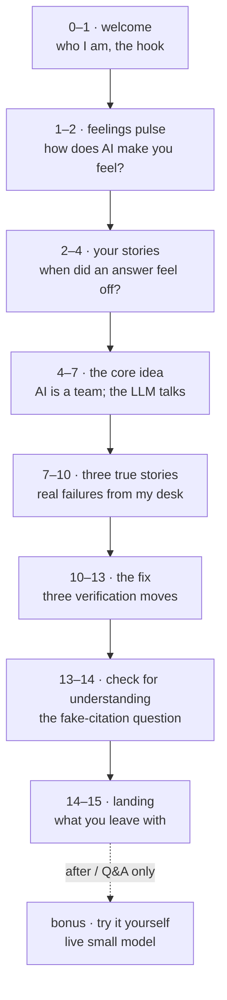

# `mini-lesson/` — "Did the AI Just Lie to Me?"

A complete **15-minute standalone segment**, drawn from
[Module 5](../lessons/05-research-information.html). It is the shortest
possible version of the course: enough to run as a single workshop, a
conference lightning talk, or a taster before someone commits to all eight
modules.

Live: <https://lessons.mattvalancy.com/intro-ai-tools/mini-lesson/>

**The page is the deck.** There are no slides — the instructor shares a
browser tab and scrolls. That choice is deliberate: it removes a dependency
(no PowerPoint, no export), and the site itself quietly demonstrates building
with the tools the course teaches.

## The 15 minutes

Timing chips are printed on each section, so the page doubles as a visible
agenda and keeps the presenter honest. A countdown timer sits bottom-right.

Three participation beats (feelings, stories, the closing check) are
intentional — each offers voice, chat, *or* just thinking, so the format
doesn't privilege one communication style.

## The teaching idea

**"AI" is not "LLM."** People say AI when they mean an LLM. Real AI systems
are teams of parts; the LLM is the one that talks, and it's the part that
makes things up. The page makes that concrete with a component row and with
Graphlings as a worked example — a database that never invents a memory, next
to an LLM that will.

From there: an LLM predicts the next word, so confidence is part of the
interface rather than evidence. Then three real failures, then the fix —
**open the source, get a second opinion, test it against reality.**

## Interactive pieces

| Element | What it does | Code |
|---|---|---|
| Next-word demo | Types a true completion, then a confident *fabricated* citation, with probability chips | `js/lesson-reveal.js` |
| Countdown timer | 15:00, click to start/pause, amber at 5 min, red at 2, counts up in overtime | `js/lesson-reveal.js` |
| Slide rail + chips | Jump between sections; current section's chip lights up | `js/lesson-reveal.js` |
| **Try it yourself** | A live terminal talking to a real 1.5B model | `js/ask-widget.js` → `functions/api/ask.js` |

## The live model widget

Sits **below the landing section, deliberately outside the timed 15 minutes** —
it's for Q&A or afterwards, so a live model can never derail the assessed
portion. It talks to a genuinely small model (`graphling-small`) on private
hardware via the Graphlings AI gateway.

Pedagogically it *is* the lesson: small models confabulate readily, so asking
it something obscure demonstrates hallucination live rather than describing it.
The suggested "spark" questions are chosen to invite exactly that.

It carries the course's **ownership** argument too, without a word of
advocacy: the thing answering you is a real model on a real machine somebody
owns, not a rented endpoint. Keep that framing factual — the page should show
it, not argue it.

Architecture, rate limiting, and the incident history are documented in
[`functions/README.md`](../../functions/README.md). Note the visible
disclaimer under the widget — the output is unfiltered and explicitly not the
author's words.

## Presenter notes

The minute-by-minute script, contingencies, and Q&A preparation live in
`ignored/mini-lesson-presenter-notes.md` — **private and gitignored**.
Nothing from it belongs on a public page.
