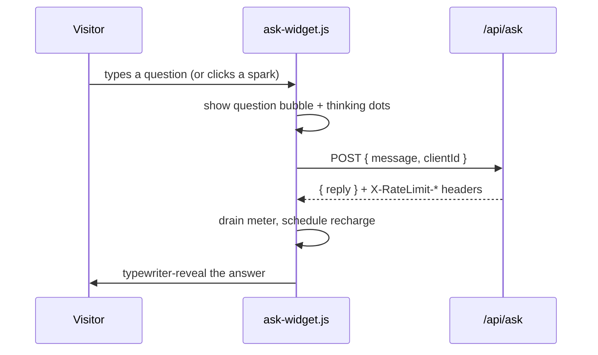

# `js/` — client-side behaviour

Three small, dependency-free scripts. **All of them are progressive
enhancement**: every page must remain readable and usable with JavaScript
disabled. Nothing here fetches a framework, and there is no build step.

| File | Used by | Purpose |
|---|---|---|
| `hero-graph.js` | hub + course + mini-lesson heroes | Animated node-graph canvas behind hero sections (all canvases on the page) |
| `lesson-reveal.js` | **every page** | Scroll reveal everywhere; on the mini-lesson also progress bar, slide rail, timing chips, next-word demo, 15-minute timer |
| `ask-widget.js` | mini-lesson | The live small-model terminal that calls `/api/ask` |

## `hero-graph.js`

Draws drifting nodes, proximity edges, and travelling signal pulses on **every**
`<canvas class="hero-canvas">` on the page (each gets its own independent
simulation). Renders a single static frame under `prefers-reduced-motion`.

Colours are **read from the stylesheet**, not hard-coded: the script pulls
`--accent-rgb`, `--signal-rgb`, and `--ink-soft-rgb` off the canvas element via
`getComputedStyle`, so a theme flip in CSS flips the animation with it and the
palette lives in exactly one place. Each token has a fallback, so a stale
cached stylesheet degrades to the right colours instead of a blank hero. It
still detects a dark container (`body.deck`) to raise its alpha gain.

Nodes come in three kinds — plain (`--ink-soft`), accent (`--accent`), and a
rarer signal node (`--signal`) — matching the two-tone constellation of the
static SVGs in the page markup. **If you add a theme, add `--ink-soft-rgb` and
`--signal-rgb` to it**, or this script falls back to the light palette.

## `lesson-reveal.js`

Loaded on every page, but almost all of it is opt-in: each feature guards on
the element it needs, so on an ordinary content page the script does exactly
one thing — reveal `.reveal` sections. The slide rail needs `.slide`
elements, the progress bar needs `.progress-bar`, the timer needs slides, the
next-word demo needs `#token-demo`. None of those exist outside the
mini-lesson, so nothing else runs there.

- **Section reveal** on scroll via `IntersectionObserver`. Used site-wide:
  content blocks inside `<main>` are wrapped in `<section class="reveal">`.
  The hidden state is gated behind `html.js`, so no-JS readers see all
  content. Deep links (`#the-fix`) skip the animation, so a mid-talk refresh
  never lands you on a blank section.
- **Reading progress bar** and a **slide rail** of clickable dots.
- **Scrollspy** that lights the current section's timing chip.
- **Side-index scrollspy** for a `.toc` element (the resource library). It
  lights the link whose section is in a band near the top of the viewport;
  when several straddle the band the topmost wins, and when the index is a
  horizontal chip row it scrolls the lit chip into view. The list itself is
  written in the HTML, so with JS off it is still a working set of anchor
  links.
- **Games-shelf filter** on the resource library: the chips toggle
  `[hidden]` on each `.game-group`. CSS keeps the chips out of the page
  until `html.js` is set, so nobody is offered a button that does nothing.
- **Next-word prediction demo** — types a true completion (Moon landing) then a
  confident fabricated citation, with probability chips. This is the lesson's
  central idea as an animation.
- **15-minute countdown timer** — click to start/pause, double-click to reset.
  Amber under 5 minutes, red under 2, counts up in overtime so rehearsals show
  the real damage.

## `ask-widget.js`

Front-end for the live model demo. See [`../functions/README.md`](../functions/README.md)
for the server side.

Behaviours worth knowing before editing:

- **Never call `res.json()` directly.** It reads the body as text and *then*
  attempts `JSON.parse`. An edge or gateway error can return HTML, and parsing
  that blindly is what once showed visitors
  `Unexpected token '<', "<!DOCTYPE"... is not valid JSON`.
- **Errors render a message plus the server's `code`**, and log to the console,
  so a failure during a demo is diagnosable at a glance.
- **`clientId`** is a random value kept in `localStorage` so each browser gets
  its own rate-limit allowance rather than sharing one per-IP bucket with an
  entire classroom. Falls back to per-IP when storage is blocked.
- **The meter recharges.** The server returns `X-RateLimit-Reset`; spent
  segments breathe until the window rolls over, then light back up.

## Conventions

- ES5-flavoured, no transpiler, no modules — these are plain `<script defer>`
  includes.
- Guard on the element existing (`if (!root) return;`) so one script can be
  loaded on pages that don't use it.
- Honour `prefers-reduced-motion` for anything that animates.
- **Bump the `?v=` query on the `<script>` tag when you change a file here** —
  Pages caches these for 4 hours on the custom domain. See the root
  [`AGENTS.md`](../AGENTS.md).
