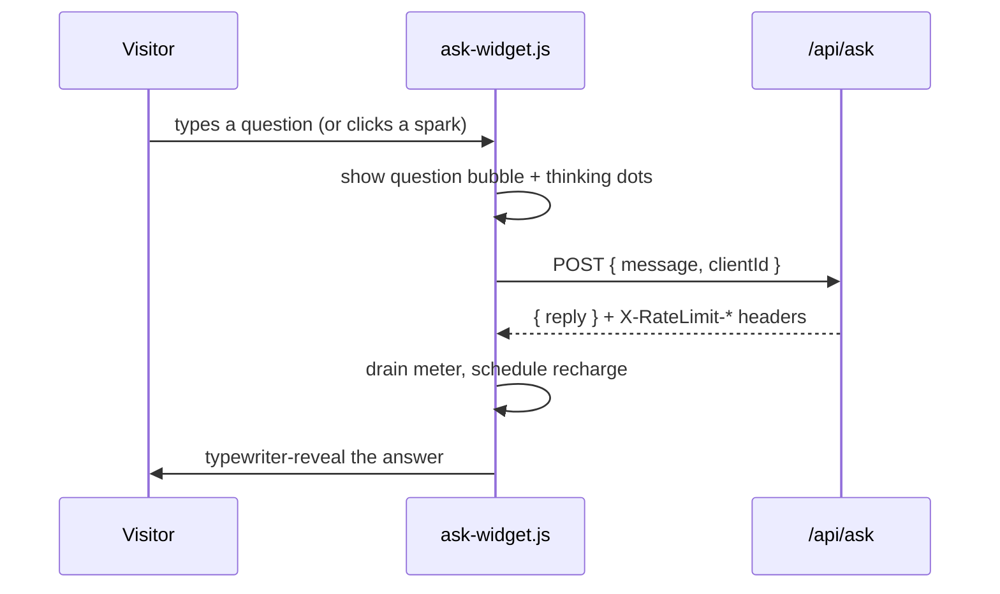

# `js/` — client-side behaviour

Three small, dependency-free scripts. **All of them are progressive
enhancement**: every page must remain readable and usable with JavaScript
disabled. Nothing here fetches a framework, and there is no build step.

| File | Used by | Purpose |
|---|---|---|
| `hero-graph.js` | **every page header** | Animated node-graph canvas behind hero sections (all canvases on the page) |
| `lesson-reveal.js` | **every page** | Scroll reveal everywhere; on the mini-lesson also progress bar, slide rail, timing chips, next-word demo, 15-minute timer |
| `ask-widget.js` | mini-lesson | The live small-model terminal that calls `/api/ask` |

## `hero-graph.js`

The site's visual identity, and since the static SVG constellations came out of
the headers, the only graph on the page. It runs on **every**
`<canvas class="hero-canvas">` on every page — the hub and course heroes, all
eight lesson headers, the resource library, the mini-lesson deck — and each
canvas gets its own simulation. **A page with a `.hero-canvas` must load this
script**; nine of them once carried the element without it and rendered an
empty box for months. Canvases stacked in the same element (the mini-lesson
header has two) **share one node and pulse budget**, so stacking never doubles
the density or the cost.

**Two layers, and that is where the depth comes from.** A far population is
smaller, dimmer, slower, and links over a shorter distance; a near population is
larger, brighter, faster, and links further. The two never link to each other —
separate meshes are most of what makes the depth read. A few pixels of parallax
separate them, drawn from eased pointer drift and from scroll position, with the
near layer moving about three times as far as the far one. Small enough that you
notice it only as space.

**Signals travel.** Every second or two a pulse sets off along an edge with a
short comet tail, lands on a node, lights that node and the edges touching it,
and with some chance fires onward to a neighbour — up to three hops. That chain
is the point: it should read as a network thinking, not as a screensaver. Nodes
also breathe, each at its own rate and phase.

**Character per context.** A canvas inside `.hero` (hub, course index) runs
dense and lively; anything else — the lesson headers, the library, the deck —
runs calmer: fewer nodes, lower gain, longer gaps between pulses. Lesson headers
sit directly behind a headline, and the CSS mask that clears the text column
does the rest. Readability is the rule the graph bends to; if you turn a knob
up, screenshot a lesson header before you keep it.

**Cost is bounded on purpose**, because this now runs on every page:

- one `requestAnimationFrame` loop drives every canvas on the page;
- it stops completely when the tab is hidden or every canvas has scrolled out
  of view (`IntersectionObserver`, 120px margin);
- nodes and pulses live in typed arrays, the pulse pool is fixed-size, and
  nothing is allocated per frame;
- drawing is batched into buckets keyed by colour and a quantised alpha (16
  steps — fine enough that a node's breath never reads as stepped), so a frame
  is a couple of dozen canvas calls instead of one per edge and one per node;
- `devicePixelRatio` is capped at 2 and at ~2.2M backing pixels.

Measured in headless Chrome with the GPU off, which is a pessimistic stand-in
for a mid-range phone: ~0.56 ms/frame for a 1440×620 hero (~165 nodes),
~0.06 ms/frame at 390×560. Under `prefers-reduced-motion` it settles the drift,
lands a few pulses and freezes two more mid-flight, then draws one still frame
and never starts the loop.

Colours are **read from the stylesheet**, not hard-coded: the script pulls
`--accent-rgb`, `--signal-rgb`, and `--ink-soft-rgb` off the canvas element via
`getComputedStyle`, so a theme flip in CSS flips the animation with it and the
palette lives in exactly one place. Each token has a fallback, so a stale
cached stylesheet degrades to the right colours instead of a blank hero. It
still detects a dark container (`body.deck`) to raise its alpha gain.

Nodes come in three kinds — plain (`--ink-soft`), accent (`--accent`), and a
rarer signal node (`--signal`), which the far layer barely uses and the near
layer carries. **If you add a theme, add `--ink-soft-rgb` and `--signal-rgb` to
it**, or this script falls back to the light palette.

## `lesson-reveal.js`

Loaded on every page, but almost all of it is opt-in: each feature guards on
the element it needs, so on an ordinary content page the script does exactly
one thing — reveal `.reveal` sections. The slide rail needs `.slide`
elements, the progress bar needs `.progress-bar`, the timer needs slides, the
next-word demo needs `#token-demo`. None of those exist outside the
mini-lesson, so nothing else runs there.

- **Section reveal** on scroll via `IntersectionObserver`. Used site-wide:
  content blocks inside `<main>` are wrapped in `<section class="reveal">`.
  The hidden state is gated behind `html.js`, so no-JS readers see all
  content. Deep links (`#the-fix`) skip the animation, so a mid-talk refresh
  never lands you on a blank section.
- **Reading progress bar** and a **slide rail** of clickable dots.
- **Scrollspy** that lights the current section's timing chip.
- **Side-index scrollspy** for a `.toc` element (the resource library). It
  lights the link whose section is in a band near the top of the viewport;
  when several straddle the band the topmost wins, and when the index is a
  horizontal chip row it scrolls the lit chip into view. The list itself is
  written in the HTML, so with JS off it is still a working set of anchor
  links.
- **Games-shelf filter** on the resource library: the chips toggle
  `[hidden]` on each `.game-group`. CSS keeps the chips out of the page
  until `html.js` is set, so nobody is offered a button that does nothing.
- **Next-word prediction demo** — types a true completion (Moon landing) then a
  confident fabricated citation, with probability chips. This is the lesson's
  central idea as an animation.
- **15-minute countdown timer** — click to start/pause, double-click to reset.
  Amber under 5 minutes, red under 2, counts up in overtime so rehearsals show
  the real damage.

## `ask-widget.js`

Front-end for the live model demo. See [`../functions/README.md`](../functions/README.md)
for the server side.

Behaviours worth knowing before editing:

- **Never call `res.json()` directly.** It reads the body as text and *then*
  attempts `JSON.parse`. An edge or gateway error can return HTML, and parsing
  that blindly is what once showed visitors
  `Unexpected token '<', "<!DOCTYPE"... is not valid JSON`.
- **Errors render a message plus the server's `code`**, and log to the console,
  so a failure during a demo is diagnosable at a glance.
- **`clientId`** is a random value kept in `localStorage` so each browser gets
  its own rate-limit allowance rather than sharing one per-IP bucket with an
  entire classroom. Falls back to per-IP when storage is blocked.
- **The meter recharges.** The server returns `X-RateLimit-Reset`; spent
  segments breathe until the window rolls over, then light back up.

## Conventions

- ES5-flavoured, no transpiler, no modules — these are plain `<script defer>`
  includes.
- Guard on the element existing (`if (!root) return;`) so one script can be
  loaded on pages that don't use it.
- Honour `prefers-reduced-motion` for anything that animates.
- **Bump the `?v=` query on the `<script>` tag when you change a file here** —
  Pages caches these for 4 hours on the custom domain. See the root
  [`AGENTS.md`](../AGENTS.md).
