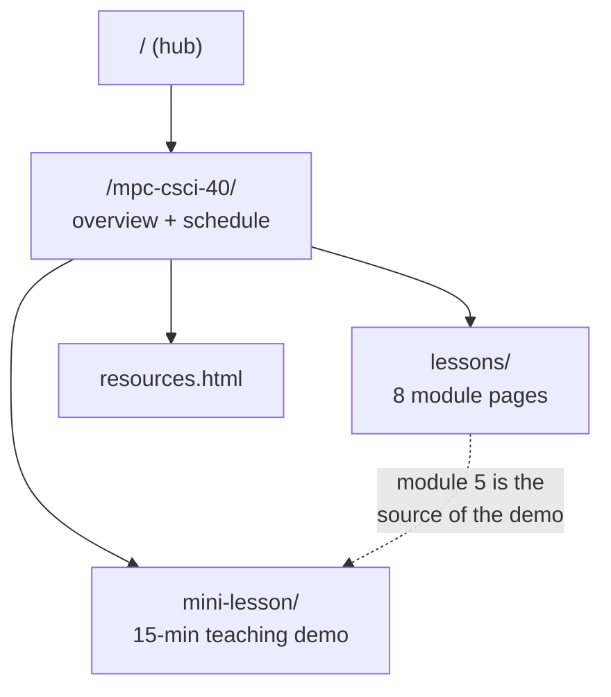

# CSCI 40 — Introduction to AI Tools

Course material for **CSCI 40: Introduction to AI Tools**, a 1-unit survey
course at Monterey Peninsula College.

> **This course has not been taught.** The site was built as part of the
> interview process for the position. Every page under this directory carries
> that notice at the top — see [Conventions](#conventions).

Live: <https://lessons.mattvalancy.com/mpc-csci-40/>

## Contents

| Path | What it is |
|---|---|
| `index.html` | Course overview, learning outcomes, module grid, session schedule |
| `lessons/` | One page per module — [see `lessons/README.md`](lessons/README.md) |
| `mini-lesson/` | The 15-minute teaching demo — [see `mini-lesson/README.md`](mini-lesson/README.md) |
| `resources.html` | Free tools, open textbooks, and per-module tool list |

## Course facts

Taken from the approved course outline of record. Treat these as fixed —
they're what the college signed off on:

- **1 unit**, 10 in-person Thursday evening sessions, 6:00–9:10 PM
- Fall 2026: **Sep 24 – Dec 3**, no class Nov 26 (Thanksgiving)
- Letter grade or Pass/No Pass; assessment by assignments, participation,
  hands-on labs, and a capstone
- Audience: **general students, no coding background**
- Recommended free text: *Elements of AI* (elementsofai.com)

**Learning outcomes:**

1. Use AI tools to complete tasks in writing, research, data analysis, and
   creative expression.
2. Evaluate AI outputs for accuracy, bias, and ethical implications.

## Structure

The eight modules map to ten sessions — the capstone spans sessions 8, 9 and
10:

| Module | Session(s) | Topic |
|---|---|---|
| 1 | Sep 24 | What is AI? Past, Present, and Future |
| 2 | Oct 1 | Generative AI for Everyday Productivity |
| 3 | Oct 8 | Working with AI Images, Audio, and Video |
| 4 | Oct 15 | AI and Data: Spreadsheets & Visualization |
| 5 | Oct 22 | AI for Research and Information Gathering |
| 6 | Oct 29 | Ethics, Bias, and Responsible AI |
| 7 | Nov 5 | Automation with AI Assistants |
| 8 | Nov 12 · Nov 19 · Dec 3 | Capstone Showcase |

## Conventions

- **The notice bar is mandatory.** Every page here opens with the
  `.notice-bar` div as the first element in `<body>`, stating the course
  hasn't been taught. New pages must include it.
- **No MPC branding.** No logos, nothing implying official affiliation. The
  footer disclaimer stays.
- **Tone**: plain language, welcoming to non-programmers.
- Nav and footer are duplicated per page (no templating). Change one, change
  all.
