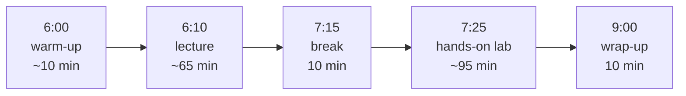

# `lessons/` — the eight module pages

One page per module of CSCI 40. Each is a **lesson plan**, not a handout: it's
written for the instructor to teach from and for students to review after.

| File | Module | Session |
|---|---|---|
| `01-what-is-ai.html` | What is AI? Past, Present, and Future | Sep 24 |
| `02-everyday-productivity.html` | Generative AI for Everyday Productivity | Oct 1 |
| `03-images-audio-video.html` | Working with AI Images, Audio, and Video | Oct 8 |
| `04-spreadsheets-data.html` | AI and Data: Spreadsheets & Visualization | Oct 15 |
| `05-research-information.html` | AI for Research and Information Gathering | Oct 22 |
| `06-ethics-bias.html` | Ethics, Bias, and Responsible AI | Oct 29 |
| `07-automation.html` | Automation with AI Assistants | Nov 5 |
| `08-capstone.html` | Capstone Showcase | Nov 12 · 19 · Dec 3 |

## The page skeleton

**Every lesson page follows the same section order.** Keep it when editing —
consistency is what makes them usable as a set:

1. **Header** — module number, session, date, time
2. **Overview** — a paragraph on why the session matters
3. **Learning objectives** — in an `.objectives` block
4. **Session agenda** — an `.agenda` list, minute-by-minute
5. **Materials** — in a `.materials` block
6. **Homework**
7. **Prev/next navigation**

## The session rhythm

Every three-hour evening follows the same shape, which comes from the course
outline's split of lecture vs. lab hours:

The lab is deliberately the longest block. The course is a *lab* course by
its outline of record (25.5 lab hours vs 8.5 lecture hours) — students should
be using the tools, not watching someone else use them.

## Module 5 is special

`05-research-information.html` is the source of the
[mini-lesson](../mini-lesson/README.md) — the standalone 15-minute teaching
demo. It carries a badge linking to it. If you change the module's framing of
hallucination or fact-checking, check the mini-lesson still agrees with it.

## Conventions

- The `.notice-bar` (course not yet taught) is the first element in `<body>`.
- Root-relative links only: `/mpc-csci-40/lessons/…`.
- Placeholder blocks (`.placeholder`) mark material still to be written —
  slides, worksheets. That's honest, not a TODO dump; keep them tidy.
